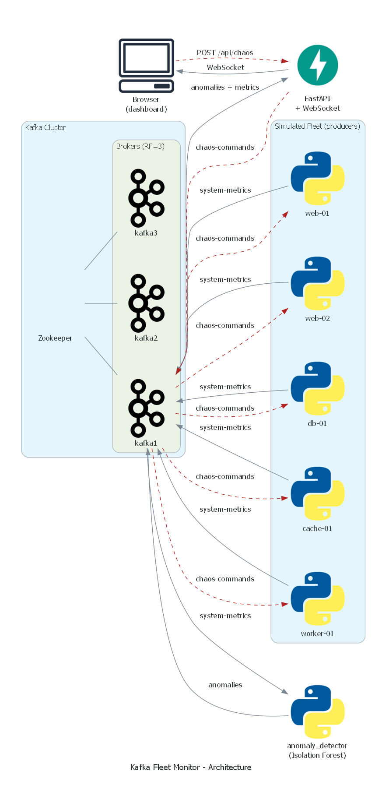
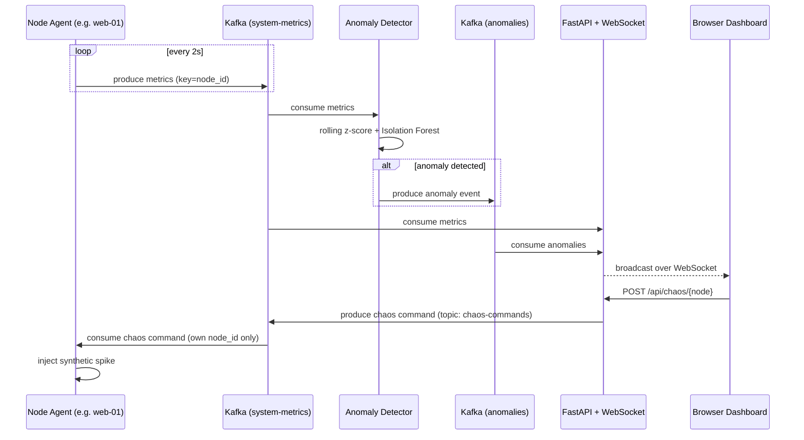

# Kafka Fleet Monitor

A real-time system-monitoring pipeline built on a genuine 3-broker Kafka cluster with Zookeeper — simulating a heterogeneous server fleet, detecting anomalies with an unsupervised ML model, and streaming everything live to a browser dashboard. Includes a chaos-injection control loop so you can trigger a synthetic incident and watch the pipeline catch it end-to-end.

## Architecture



**Message flow:**



## What it does

- Simulates a 5-node heterogeneous fleet (web, db, cache, worker profiles), each publishing CPU/memory readings to Kafka every 2 seconds.
- Runs a real 3-broker Kafka cluster (replication factor 3, min in-sync replicas 2) coordinated by Zookeeper — not a single-node toy setup.
- Detects anomalies with a rolling per-node statistical baseline (z-score) plus an unsupervised Isolation Forest model retrained on a sliding window, catching both single-metric outliers and unusual CPU/memory combinations.
- Streams metrics and anomalies live to a browser dashboard over WebSocket, with per-node sparkline charts and a live anomaly feed.
- Includes a chaos-injection control plane: trigger a CPU spike or memory leak on any node (via the dashboard button or a direct API call) and watch the detector flag it in real time.
- Fully containerized — `docker compose up` builds and runs all 11 services (Zookeeper, 3 brokers, topic init, 5 producers, the detector, the API) from a clean slate.

## Tech stack

Kafka · Zookeeper · Python · confluent-kafka · scikit-learn (Isolation Forest) · FastAPI · WebSocket · Chart.js · Docker Compose

## Quick start

```bash
docker compose up -d --build
```

Wait for all services to report healthy (`docker compose ps`), then open `http://localhost:8000/`.

To manually trigger an incident from the CLI instead of the dashboard button:

```bash
curl -X POST http://localhost:8000/api/chaos/web-01 \
  -H "Content-Type: application/json" \
  -d '{"type": "cpu_spike", "duration_seconds": 30}'
```

To watch Kafka rebalance a scaled consumer group live:

```bash
docker compose up -d --scale anomaly-detector=2
```

## Project structure

```
kafka-fleet-monitor/
├── docker-compose.yml
├── docs/
│   └── architecture.png
├── scripts/
│   ├── run_fleet.ps1
│   ├── inject_chaos.py
│   └── generate_diagram.py
├── producers/
│   ├── node_agent.py
│   ├── requirements.txt
│   └── Dockerfile
├── consumers/
│   ├── anomaly_detector.py
│   ├── requirements.txt
│   └── Dockerfile
├── api/
│   ├── main.py
│   ├── requirements.txt
│   └── Dockerfile
└── dashboard/
    ├── index.html
    ├── style.css
    └── app.js
```

## Design notes and known limitations

- **Partition skew is real here.** With only 5 distinct node-id keys hashed across 6 partitions, load isn't perfectly even across partitions or across consumers in a scaled group — a genuine production concern (hot partitions), not something this project hides from.
- **State is in-memory in the API layer.** `latest_state`/`recent_anomalies` reset on restart; a production version would persist metrics and anomaly history to a time-series store (e.g. Postgres/Timescale) instead.
- **The anomaly model is intentionally simple.** Isolation Forest on a small rolling window is fast and interpretable but naive compared to a proper time-series model (e.g. an LSTM autoencoder) — a deliberate scope choice to keep the detector explainable.
- **No auth/TLS on the Kafka listeners or the API** — fine for a local/demo deployment, not how this would ship in production.

## Possible extensions

- Persist metrics/anomalies to Postgres for historical queries and trend charts.
- Swap Zookeeper-mode Kafka for KRaft mode (no Zookeeper) and compare operationally.
- Replace/augment Isolation Forest with a time-series-aware model.
- Deploy across real separate hosts instead of one Docker network, to test actual network-partition behavior.
- Add Prometheus + Grafana for broker-level JMX metrics alongside the simulated application metrics.

## License

MIT
